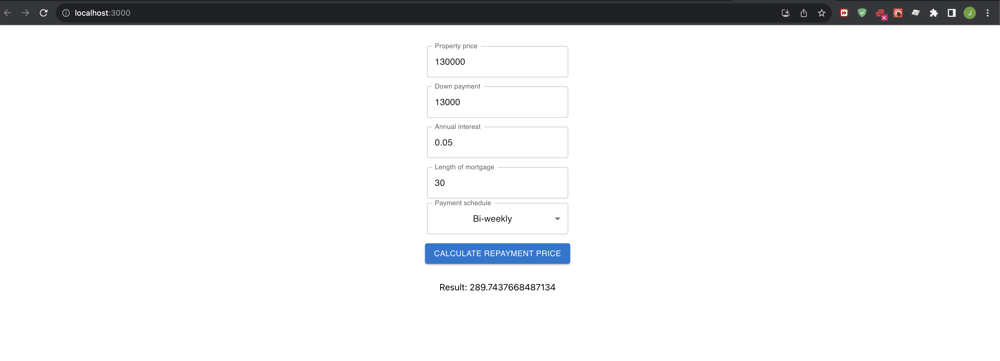

# MortgageCalculator
API that calculates mortgage repayments

Currently hosted on AWS as a API Gateway triggered lambda.

URL = "https://tza2ahe76k.execute-api.us-west-1.amazonaws.com/mortgageCalculator"

# Node version
Recomended version: v20.5.1

# Testing
To test you will need to install dependencies
run `npm i` - from the `mortgageCalculator` directory

Then you can run 
run `npm t`- from the `mortgageCalculator` directory

# Paramaters for Api
propertyPrice    -> Cannot be 0
downPayment      -> Cannot be 0, must be more than 10% of propertyPrice 
annualInterest   -> Cannot be zero, must be between 0 and 1
lengthOfMortgage -> between 5 - 30 and a mulitple of 5
paymentSchedule  -> 1: accelerated bi-weeky, 2: bi-weekly or 3: monthly

# To run UI locally
Clone the Repo down from `https://github.com/jonathan-v93/mortage-calculator-ui`

run `npm i` in the repo's root directory

run `npm start` in the repo's root directory

The UI should pop up in your prefered browser. Alternativly you can navigate to the UI here once the build has completed. -> `http://localhost:3000/`

